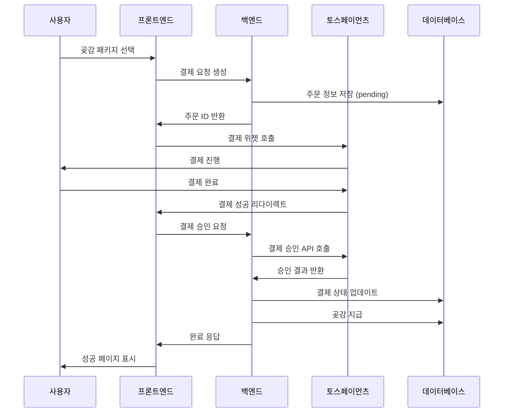

# 🏦 토스페이먼츠 결제 시스템 설정 가이드

## 📋 개요

호담 프로젝트에 토스페이먼츠를 이용한 곶감 결제 시스템이 구현되었습니다.

## 🔧 설정 방법

### 1. 토스페이먼츠 계정 생성

1. [토스페이먼츠 개발자센터](https://developers.tosspayments.com/) 접속
2. 회원가입 및 로그인
3. 새 애플리케이션 생성

### 2. API 키 발급

#### 테스트 환경

```bash
# 클라이언트 키 (공개키) - 토스페이먼츠에서 발급받은 테스트 키 입력
NEXT_PUBLIC_TOSS_PAYMENTS_CLIENT_KEY=test_ck_YOUR_TEST_CLIENT_KEY

# 시크릿 키 (비밀키) - 토스페이먼츠에서 발급받은 테스트 시크릿 키 입력
TOSS_PAYMENTS_SECRET_KEY=test_sk_YOUR_TEST_SECRET_KEY
```

#### 프로덕션 환경

```bash
# 실제 발급받은 키로 교체
NEXT_PUBLIC_TOSS_PAYMENTS_CLIENT_KEY=live_ck_YOUR_LIVE_CLIENT_KEY
TOSS_PAYMENTS_SECRET_KEY=live_sk_YOUR_LIVE_SECRET_KEY
```

### 3. 환경변수 설정

`.env.local` 파일에 다음 내용 추가:

```bash
# 토스페이먼츠 설정 - 실제 발급받은 키로 교체 필요
NEXT_PUBLIC_TOSS_PAYMENTS_CLIENT_KEY=test_ck_YOUR_TEST_CLIENT_KEY
TOSS_PAYMENTS_SECRET_KEY=test_sk_YOUR_TEST_SECRET_KEY
```

### 4. 웹훅 설정 (선택사항)

토스페이먼츠 대시보드에서 웹훅 URL 설정:

```
https://your-domain.com/api/webhooks/toss-payments
```

## 🏗️ 구현된 기능

### 1. 결제 API (`src/app/api/payment.ts`)

- 결제 요청 생성
- 결제 승인 처리
- 결제 상태 관리
- 곶감 지급 처리

### 2. 곶감 API 확장 (`src/app/api/bead.ts`)

- 곶감 패키지 정보
- 결제를 통한 곶감 구매
- 결제 완료 후 곶감 지급
- 결제 내역 조회

### 3. 결제 UI (`src/app/bead/page.tsx`)

- 곶감 패키지 선택
- 토스페이먼츠 결제 위젯 연동
- 결제 내역 표시
- 로딩 상태 관리

### 4. 결제 성공 페이지 (`src/app/payment/success/page.tsx`)

- 결제 완료 처리
- 곶감 지급 확인
- 사용자 피드백

## 💳 곶감 패키지

| 패키지 | 수량  | 정가     | 할인가   | 할인율 |
| ------ | ----- | -------- | -------- | ------ |
| 기본   | 5개   | 3,000원  | 2,500원  | 17%    |
| 인기   | 10개  | 6,000원  | 5,000원  | 17%    |
| 알뜰   | 20개  | 12,000원 | 10,000원 | 17%    |
| 대용량 | 100개 | 60,000원 | 50,000원 | 17%    |

## 🔄 결제 플로우



## 🛡️ 보안 고려사항

### 1. API 키 보안

- 시크릿 키는 서버 환경변수에만 저장
- 클라이언트 키는 공개되어도 안전
- 프로덕션과 테스트 키 분리

### 2. 결제 검증

- 서버에서 결제 금액 재검증
- 중복 결제 방지
- 위변조 방지

### 3. 데이터 보호

- 결제 정보 암호화 저장
- 개인정보 최소 수집
- HTTPS 필수

## 🧪 테스트 방법

### 1. 테스트 카드 정보

```
카드번호: 4242424242424242
유효기간: 12/25
CVC: 123
```

### 2. 테스트 시나리오

1. 곶감 패키지 선택
2. 결제 진행
3. 테스트 카드로 결제
4. 결제 완료 확인
5. 곶감 지급 확인

## 📊 모니터링

### 1. 결제 상태 확인

```sql
-- 결제 내역 조회
SELECT * FROM payment_history
ORDER BY created_at DESC;

-- 결제 성공률
SELECT
  status,
  COUNT(*) as count,
  ROUND(COUNT(*) * 100.0 / SUM(COUNT(*)) OVER(), 2) as percentage
FROM payment_history
GROUP BY status;
```

### 2. 곶감 지급 확인

```sql
-- 사용자별 곶감 현황
SELECT
  u.email,
  b.count as bead_count,
  COALESCE(SUM(ph.bead_quantity), 0) as total_purchased
FROM users u
LEFT JOIN bead b ON u.id = b.user_id
LEFT JOIN payment_history ph ON u.id = ph.user_id AND ph.status = 'completed'
GROUP BY u.id, u.email, b.count;
```

## 🚀 프로덕션 배포

### 1. 체크리스트

- [ ] 실제 토스페이먼츠 API 키 설정
- [ ] 도메인 검증 완료
- [ ] 웹훅 URL 설정
- [ ] 결제 테스트 완료
- [ ] 모니터링 시스템 구축

### 2. 환경변수 설정

```bash
# 프로덕션 환경
NEXT_PUBLIC_TOSS_PAYMENTS_CLIENT_KEY=live_ck_실제키
TOSS_PAYMENTS_SECRET_KEY=live_sk_실제키
```

## 📞 지원

### 토스페이먼츠 문의

- 개발자센터: https://developers.tosspayments.com/
- 고객센터: 1588-7711

### 호담 프로젝트 문의

- 이메일: dldbstls7777@naver.com
- 개발자: 이윤신

---

**⚠️ 주의사항**

- 테스트 키는 실제 결제가 되지 않습니다
- 프로덕션 배포 전 반드시 실제 키로 교체하세요
- 결제 관련 법적 요구사항을 확인하세요
